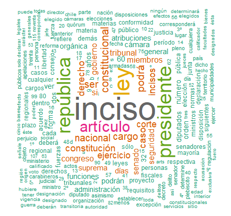
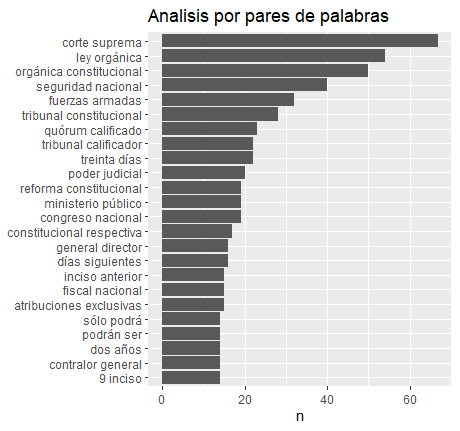
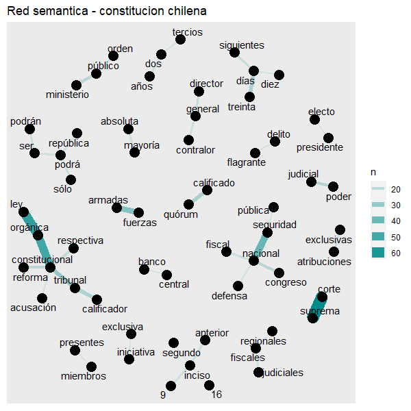

# Análisis de text mining a la actual constitución política chilena

El objetivo de este análisis es generar una revisión objetiva a la constitución política chilena a través de la tecnica de text mining, analizando cuales son las palabras con mayores reiteraciones en el documento y tambíen las relaciones entre pares de palabras.

## Primer análisis: Nube de texto

De las palabras que más se repiten dentro de la constitución están la de "República" (Ya que esta es la forma de gobierno del país) y "Presidente" (Ya que el país funciona como una república presidencialista), teniendo un poco menos de repeticion (pero aún así con una repetición considerable) las palabras "Congreso" y "Senado".

## Segundo análisis: Por pares de palabras

Las combinaciones de palabras más frecuentes fueron "Corte suprema", "Ley orgánica" y "Organica constitucional". De cerca, le siguen "Seguridad nacional" y "Fuerzas armadas".

## Tercer análisis: Por red semántica

Las redes semánticas ayudan a ver las relaciones entre las distintas palabras. Aqui se puede ver nuevamente la importancia de la palabra "Constitucional", que genera "Ley organica constitucional", "Reforma constitucional" y "Tribunal constitucional". Tambien es posible observar la importancia de la palabra "Nacional", que genera "Congreso nacional", "Defensa nacional", "Seguridad nacional" y "Fiscal nacional".

